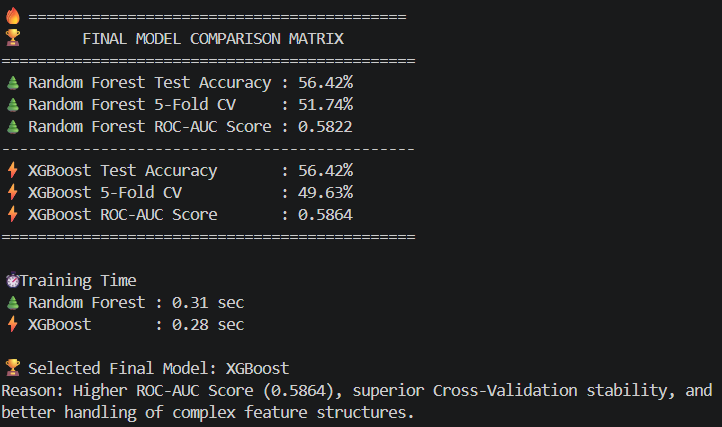
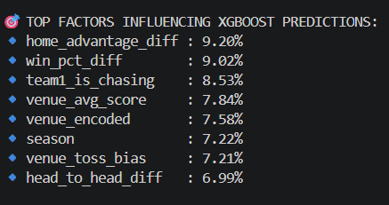
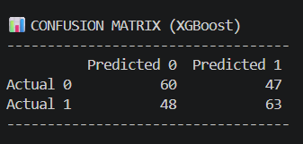

# 🏏 IPL Performance Analytics System

An end-to-end IPL Analytics and Machine Learning project built using PostgreSQL, SQL, Python, Power BI, and XGBoost to analyze historical IPL data and predict match outcomes.

---

## Project Overview

The IPL Performance Analytics System transforms raw IPL datasets into meaningful insights through data engineering, business intelligence, and machine learning.

The project follows a complete analytics lifecycle:

* Data Collection
* Database Design
* Data Cleaning
* SQL Analytics
* Data Modeling
* Power BI Dashboard Development
* Machine Learning & Prediction
* Web Application Deployment ✅ Live

---

## Technology Stack

### Database

* PostgreSQL
* SQL

### Data Processing

* Python
* Pandas
* NumPy

### Machine Learning

* Scikit-Learn
* Random Forest
* XGBoost

### Data Visualization 

* Power BI

### Web Interface

* Streamlit

### Version Control

* Git
* GitHub

### Deployment (Upcoming)

* Streamlit Cloud

---

## Project Workflow

```text
Raw IPL Dataset
      ↓
Database Setup
      ↓
Data Cleaning
      ↓
Analytics Layer
      ↓
SQL Views & Reporting Layer
      ↓
Power BI Dashboards
      ↓
Machine Learning Models
      ↓
Streamlit Web Application
      ↓
Cloud Deployment ✅ Live
```

---

## 🚀 Project Progress

### ✅ Phase 1 – Database Setup

* Designed PostgreSQL database schema
* Imported and validated IPL datasets
* Ensured data quality and consistency

### ✅ Phase 2 – Data Cleaning & Preprocessing

* Standardized team and venue names
* Handled missing and inconsistent records
* Prepared clean analytical datasets

### ✅ Phase 3 – Analytics Layer

* Developed team, batting, bowling, venue, and season analytics
* Generated SQL-based business insights

### ✅ Phase 4 – Data Modeling & SQL Views

* Built optimized reporting views
* Created performance, season, venue, and head-to-head analysis layers

### ✅ Phase 5 – Power BI Dashboard

* Designed 6 interactive dashboards
* Implemented KPI cards, slicers, filters, and comparative analysis
* Delivered business intelligence reporting solution

### ✅ Phase 6 – Machine Learning & Predictive Analytics

* Engineered 14 predictive features
* Trained Random Forest and XGBoost models
* Achieved 56.42% prediction accuracy
* Implemented match winner prediction system
* Performed model evaluation and feature importance analysis

📄 Detailed Documentation: `docs/phase6_machine_learning.md`

### ✅ Phase 7 – Streamlit Dashboard

* Developed interactive web application using Streamlit
* Integrated machine learning prediction engine
* Added live win probability predictions
* Implemented head-to-head and venue insights
* Optimized performance using caching

📄 Detailed Documentation: `docs/phase7_ui_development.md`

### ✅ Phase 8 – Cloud Deployment

* Deployed on Streamlit Community Cloud
* Publicly accessible at : ipl-performance-analytics.streamlit.app

---

## Dashboard Preview

## Project Demonstration

Power BI dashboard screenshots and Streamlit application screenshots are available in:

assets/screenshots/

---

## Machine Learning Outputs

### Model Performance Comparison



### XGBoost Feature Importance



### XGBoost Confusion Matrix



---

## Key Insights Generated

* Most Successful IPL Teams
* Team Win Percentages
* Season-wise Team Rankings
* Top Run Scorers
* Top Wicket Takers
* Best Economy Bowlers
* Venue Performance Analysis
* Head-to-Head Records
* Match Winner Prediction
* Team Strength Analysis

---

## Project Structure

```text
IPL-Performance-Analytics-System/

├── assets/              # Dashboard & UI screenshots
├── data/                # Datasets
├── docs/                # Phase-wise documentation
├── sql/                 # SQL scripts, analytics, views
├── machine_learning/    # Models, notebooks, outputs
├── app.py               # Streamlit web application
├── requirements.txt
├── README.md
└── .gitignore
```

---

## Future Enhancements

* Real-Time Match Predictions
* Player-Level Prediction Models
* Live IPL Data Integration
* Advanced Machine Learning Models
* Match Recommendation & Insights Engine
* Mobile-Friendly Responsive Dashboard

```
